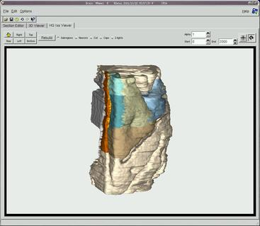

# CRS4 ViC BRAIN (QT5)

<p align="center">
    
</p>

**CRS4 ViC BRAIN** is a software for 3D reconstruction and visualization of architectonic, neurophysiological and tract tracing data of primate cerebral cortex. The system takes as input data acquired by identifying contours and neuron positions on cryogenized brain sections and regards it as a three-dimensional environment to be interactively inspected.
**CRS4 ViC BRAIN** may be used under the terms of the amended GNU General Public License appearing in the file LICENSE included in the software distribution. Installation instructions are below. This software is citeware. Please inform CRS4 of all publications that have used this software and acknowledge its usage by mentioning CRS4 ViC BRAIN and the CRS4 Visual Computing Group. 

## Installation
**CRS4 ViC BRAIN** compiles under Linux and depends on the following external libraries:
- qt5
- cmake
- zlib

Install the above libraries before continuing with the software installation.

CRS4 ViC Brain also depends on the following ViC libraries in the `dependencies` directory:
- CRS4 SL (`sl-7.9.0-Source.tar.gz`)
- CRS4 qmakeconfig (`qmakeconfig.tar.gz`)

### SL installation
Untar the SL file into a `<builddir>`:
```
# cd dependencies
# tar zxvf ./sl-7.9.0-Source.tar.gz -C <builddir>
# cd <builddir>
```
Installation instructions are in the file INSTALL into the SL package

### qmakeconfig installation
Untar the qmakeconfig file into a `<builddir>` :
```
# cd dependencies
# tar zxvf ./qmakeconfig.tar.gz -C <builddir>
# cd <builddir>
```
Run the following shell commands:
```
# qmake
# make
# sudo make install
```

### CRS4 ViC BRAIN installation

To install **CRS4 ViC BRAIN** run the following shell commands from the root directory of git package clone:
```
# qmake
# make
# sudo make install
```

## Further information
**CRS4 ViC BRAIN** software was developed by the CRS4 Visual Computing group. More information is available at this web address: (http://www.crs4.it/vic/download/brain/)

Information about the CRS4 Visual Computing group is available at this web address: (http://www.crs4.it/vic)
